# 20家全球最佳VPN服务（隐私保护与流媒体）

想用更稳的VPN服务解决隐私保护、跨区流媒体与P2P下载？本文从速度、稳定性、可定制能力、成本控制出发，精选20家全球服务商。
你将快速判断谁更适合你的设备与场景，哪些具备专用IP、端口转发、多跳与智能DNS等关键能力，降低试错成本。

## [TorGuard](<https://torguard.net>)
专业P2P与专用IP之选

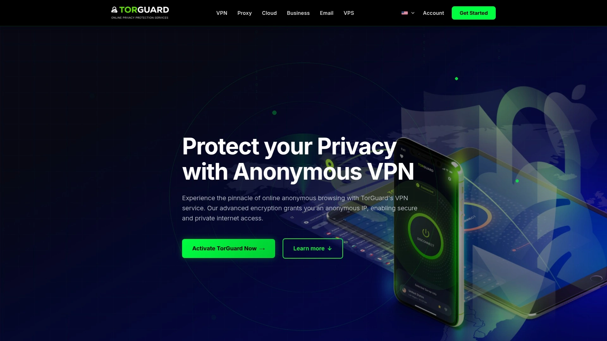

- 聚焦可定制连接：支持 WireGuard/OpenVPN，提供 Stealth 混淆与应用白名单、Kill Switch。
- 深度场景：可选专用IP/流媒体专线、端口转发，对 P2P/自建服务与跨区解锁更友好。
- 上手与成本：安装简单，3分钟首连；长期方案更划算。
- 推荐理由：在同价位下，P2P与专用IP生态更完整，兼顾速度与可控性。

## [NordVPN](<https://nordvpn.com>)
NordLynx加持的高速护航

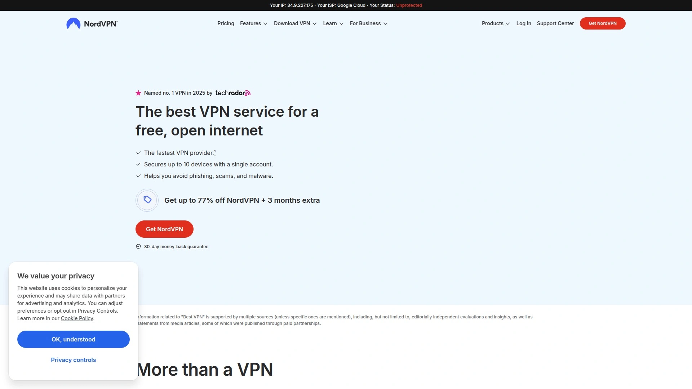

主打速度与安全并重：自研 NordLynx（基于 WireGuard）、双重VPN、多跳、威胁拦截。Meshnet 私网直连适合远程协作。
适合：流媒体、移动办公、日常常开。自动选路几乎零配置，体验稳定。

## [Surfshark](<https://surfshark.com>)
无限设备与多跳更省心体验

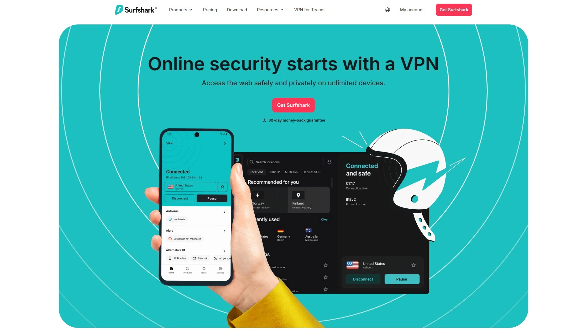

- 家庭/小团队福音：不限设备同时在线。
- 功能全：MultiHop 多跳、Rotating IP、CleanWeb 拦截、Bypass 分应用路由、静态IP可选。
- 长期价格友好，性价比高，覆盖常见使用场景。

## [ExpressVPN](<https://www.expressvpn.com>)
自研Lightway带来更顺滑

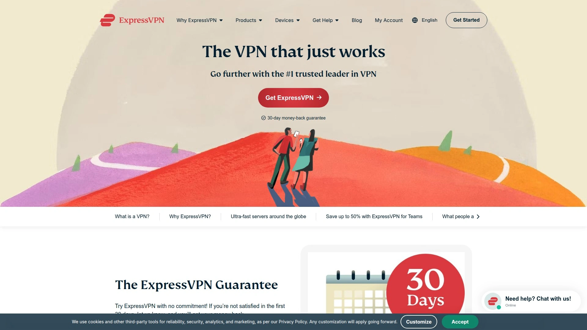

Lightway 协议连接快、漫游切换稳；TrustedServer 全内存部署与 MediaStreamer 智能DNS加持。
更偏重流媒体与差旅稳定性；价格略高，但体验与可靠性匹配。

## [CyberGhost](<https://www.cyberghostvpn.com>)
预设情景一键解锁流媒体验

- 流媒体/种子专用标签，选中即连，操作门槛低。
- NoSpy 服务器选项、泄漏防护更安心。
- 适合希望“开箱即用”的新手与重度观影用户。

## [Private Internet Access](<https://www.privateinternetaccess.com>)
开源客户端与高级自定义强

开源应用透明、端口转发与 SOCKS5 代理加持；可调加密参数与协议，平衡性能/隐私。
不限设备连接，适合多终端重度用户与P2P场景。

## [PureVPN](<https://www.purevpn.com>)
覆盖广选项多的老牌服务商

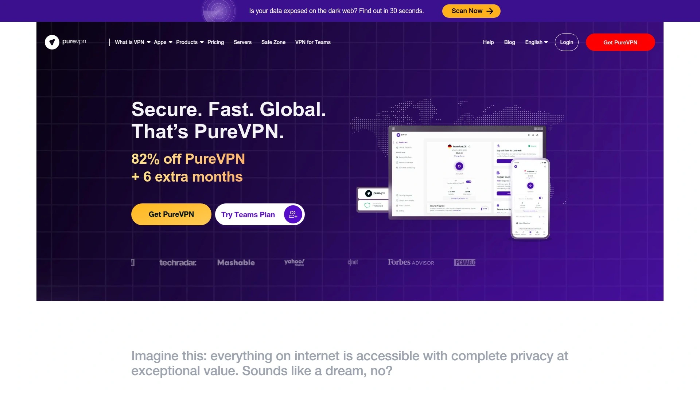

节点覆盖广，协议选择多；专用IP、端口转发等可选项完善。
客户端简洁、自动最优路由；适合兼顾跨区观影与远程办公。

## [IPVanish](<https://www.ipvanish.com>)
不限连接、国内外都稳定性

- 不限设备连接，家庭与团队共用更省心。
- 支持 WireGuard/OpenVPN，Scramble 混淆提升连通性。
- 对 Kodi/家庭影院友好，价格处于中等区间。

## [VyprVPN](<https://www.vyprvpn.com>)
自营网络与Chameleon伪装

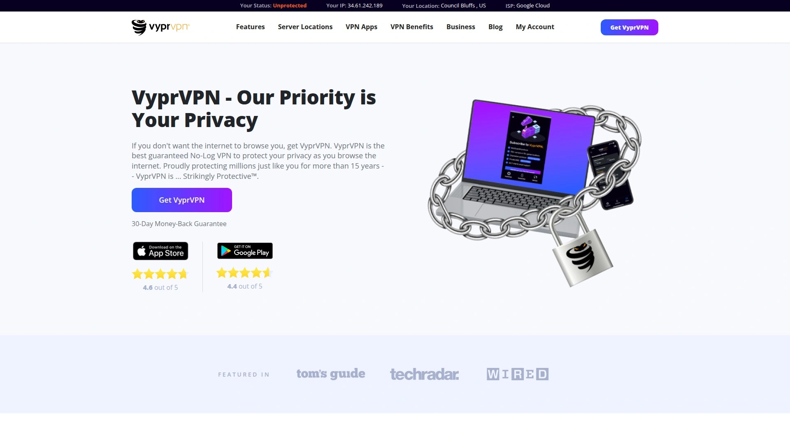

自有硬件网络降低第三方风险；Chameleon 协议有助对抗 DPI。
内置 NAT Firewall、防泄漏机制；适合在网络管控较严环境保障连通。

## [Atlas VPN](<https://atlasvpn.com>)
安全又亲民的新锐之选入门

- SafeSwap 出口共享IP、MultiHop+ 多重跳转、Tracker 拦截。
- 入门友好但功能不缩水，适合首次购买 VPN服务 的用户。
- 界面直观，自动选择最优节点。

## [Proton VPN](<https://protonvpn.com>)
瑞士血统重隐私优先理念坚

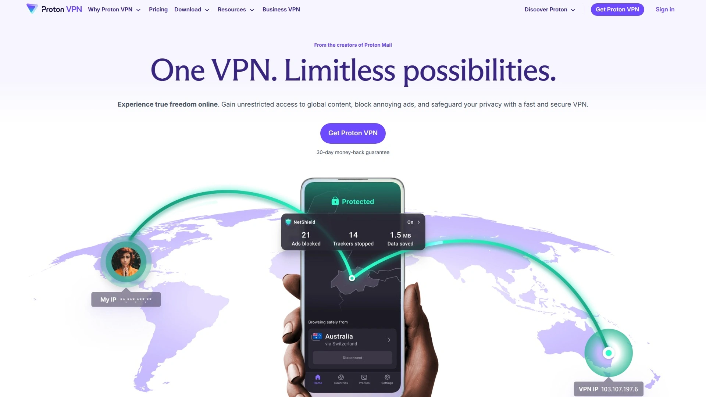

总部瑞士，Secure Core 多跳经由高隐私地区；客户端开源、支持 Tor over VPN、NetShield 防追踪。
适合极重视隐私合规与匿名性的用户。

## [hide.me](<https://hide.me>)
免费入门与强大端口转发选

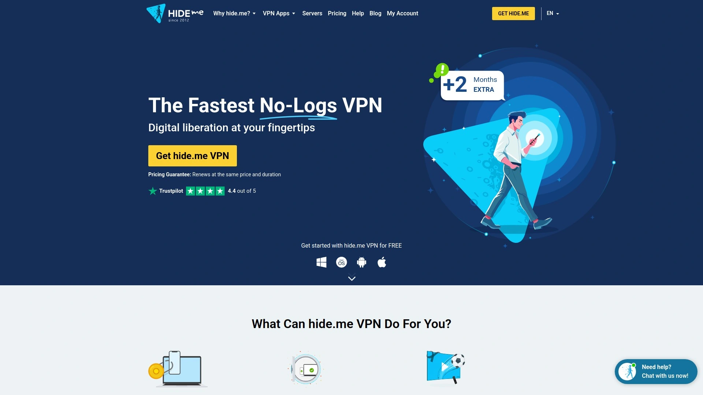

提供入门级免费方案便于测试；高级计划支持端口转发、分应用路由与多协议。
文档详尽、配置灵活，适合 P2P 与远程访问自建服务。

## [HMA VPN](<https://www.hidemyass.com>)
全球地址池与可变更IP模式

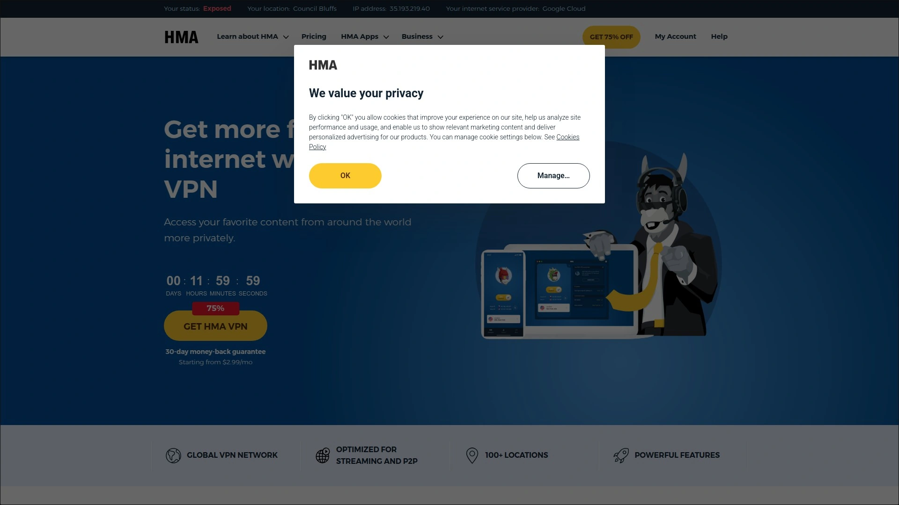

IP Shuffle 定时变更，提升抗追踪性；覆盖国家广、速度稳定。
适合跨国内容访问与一般隐私保护。

## [PrivateVPN](<https://privatevpn.com>)
小而精、解锁能力出众口碑

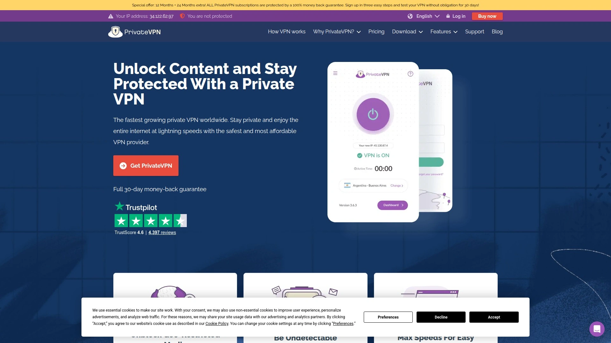

解锁主流流媒体表现亮眼；支持端口转发与 Stealth 模式。
客服远程协助友好，适合小白快速上手。

## [StrongVPN](<https://strongvpn.com>)
简单易用、入门即开箱即用

去繁就简，打开即连；支持 WireGuard/IKEv2/OpenVPN。
适合出差临时加密与公共 Wi‑Fi 防护，学习成本低。

## [Ivacy VPN](<https://www.ivacy.com>)
预算友好且功能不打折选项

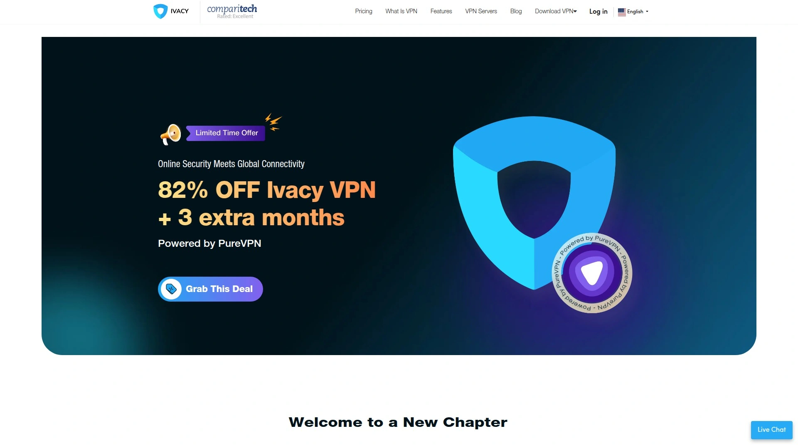

- 分应用隧道、专用IP与端口转发可选。
- App 轻量，连接稳定；长期价格亲民。
- 适合预算敏感且有刚需的用户。

## [Astrill VPN](<https://www.astrill.com>)
跨境连通与隐身表现强劲十

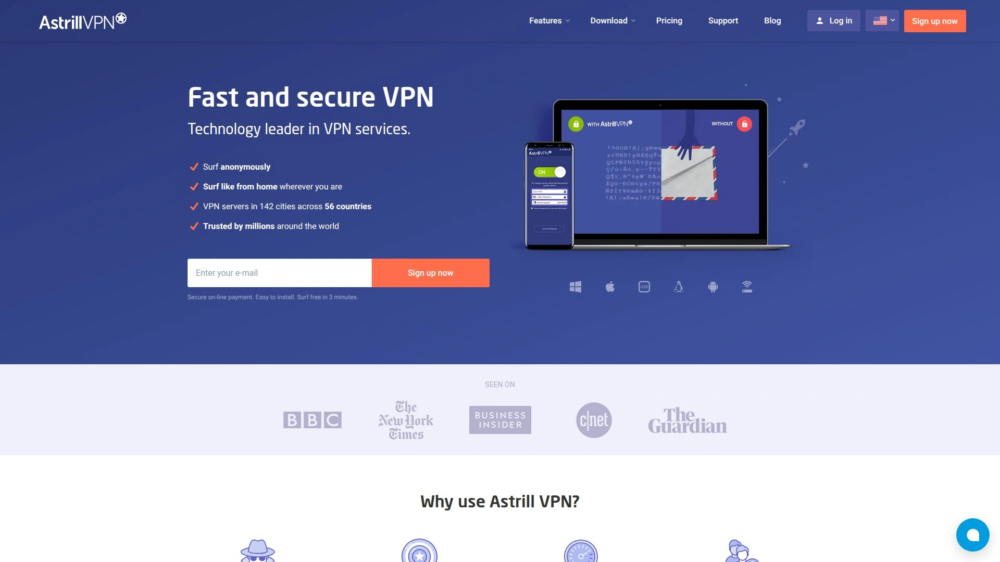

StealthVPN 与 OpenWeb 协议在跨境连通方面口碑佳；可选私有IP、应用过滤。
面向对稳定性要求极高的专业场景。

## [CactusVPN](<https://cactusvpn.com>)
内置SmartDNS更省心

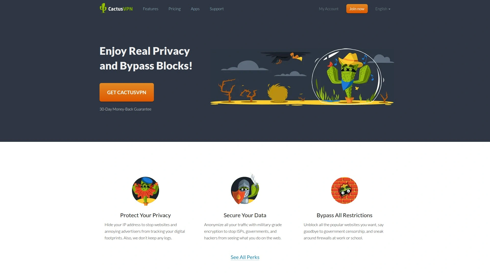

VPN + SmartDNS 组合，切区更便捷；提供应用级规则、DNS 泄漏防护。
轻量使用成本友好，适合以流媒体为主的用户。

## [Hotspot Shield](<https://www.hotspotshield.com>)
Hydra协议加速流媒体

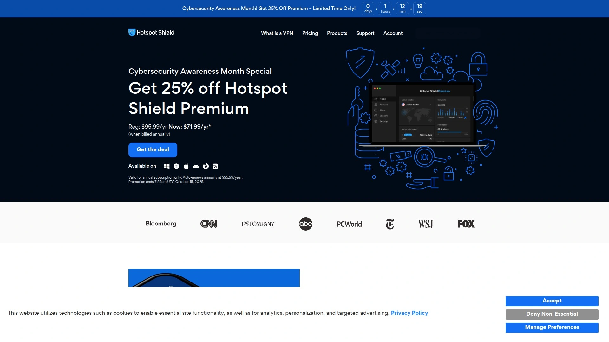

自研 Hydra 协议对长距离速度优化明显；桌面与移动端体验一致。
适合流媒体观看与公共 Wi‑Fi 加密。

## [VPN Unlimited](<https://vpnunlimited.com>)
可选静态IP与终身方案灵活

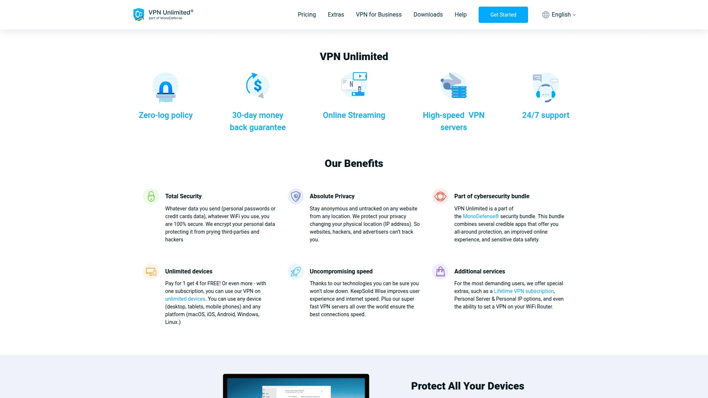

可选个人静态IP，便于远程办公白名单；协议丰富，涵盖浏览器扩展与全平台客户端。
长期方案灵活，便于固定预算。

---

## 常见问题 FAQ

- 如何选择适合我的 VPN服务？
  - 先确定主场景（流媒体解锁、P2P下载、远程办公）。再对比是否支持专用IP、端口转发、多跳等关键功能，并用试用/退款期实测速度与稳定性。

- P2P下载需要端口转发吗？
  - 建议选支持端口转发的服务（如 TorGuard、PIA、PrivateVPN），更易获得可连接度与上行速度；仅看流媒体可不必强求。

- 如何快速判断流媒体是否解锁成功？
  - 连接目标国家节点后清缓存或更换DNS；仍失败时切换专用流媒体节点、改协议/端口，或更换同国家其他服务器。

---

## 总结与下一步

以上20家VPN服务覆盖了从隐私优先到流媒体解锁、从入门到进阶的主流需求。
若你重点在P2P与可控性，[TorGuard](<https://torguard.net>) 作为第1名更适合：专用IP、端口转发与灵活混淆让连通更稳、策略更可控。
建议依据你的核心场景先试连与测速，再按长期方案锁定成本。
